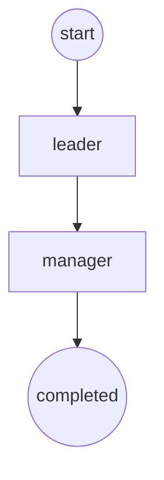

# Approval specify

    {
        "id": "leave_request",
        "version": 1,
        "name": "Leave Request",
        "on_start": true,
        "allow_recall": false,
        "condition": ["Name", "GET_FIELD", "xx", "EQUALS"], 
        "approvers": [
            {
                "name": "leader"
                "users": [],
                "role": "",
                "approval_label": "Approve",
                "denial_label": "Reject",
                "level": 1,
                "on_approve_exist": true,
                "on_deny_exist": true,
            },
            {
                "name": "manager",
                "users": [],
                "role": "",
                "approval_label": "Approve",
                "denial_label": "Reject",
                "level": 2,
                "on_approve_exist": true,
                "on_deny_exist": true,
            },
        ]
    }

No users if role exists, no role if users exists, only one field of users or role works.
Always apply the approval process if condition is empty.

# 接口列表
## Approve form
### `POST` **/form/{name}/approve

> Path Parameters

参数名 | 说明
--    | --
name  | 表单名

> Post Body:

    {
        "record_id": 1,
        "approval_id": "leave_request",
        "level": 1,
        "comment": "Agree.",
    }

> Response
    
200: OK 

    {}

400: 

    {
        "error": "error message",
    }

## Reject form
### `POST` **/form/{name}/reject

> Path Parameters

参数名 | 说明
--    | --
name  | 表单名

> Post Body:

    {
        "record_id": 1,
        "approval_id": "leave_request",
        "level": 1,
        "comment": "Reject.",
    }

> Response
    
200: OK 

    {}

400: 

    {
        "error": "error message",
    }

## recall form
### `POST` **/form/{name}/recall

> Path Parameters

参数名 | 说明
--    | --
name  | 表单名

> Post Body:

    {
        "record_id": 1,
        "approval_id": "leave_request",
        "comment": "Cancel leave request.",
    }

> Response
    
200: OK 

    {}

400: 

    {
        "error": "error message",
    }