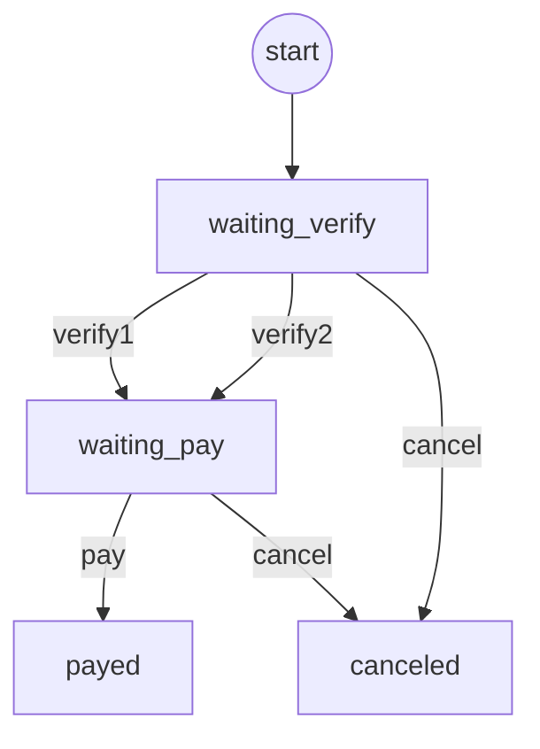

# Blueprint specify

    {
        "id": "purchase_request",
        "version": 1,
        "name": "Purchase Requet",
        "start": "waiting_verify",
        "stages": [
            {"name": "Waiting verify", "id": "waiting_verify"},
            {"name": "Waiting Pay", "id": "waiting_pay"},
            {"name": "Payed", "id": "payed"},
            {"name": "canceled", "id": "canceled"},
        ],
        "transitions": [
            {
                "id": "verify1",
                "name": "Verify1",
                "source": "waiting_verify",
                "target": "waiting_pay",
                "users": [],
                "role": "",
                "parallel": true,
                "common": false,
                "group":"ffeac65c-b9d0-11ed-a768-f40f241fd1e7",
                "on_transfer_exist": true,
            },
            {
                "id": "verify2",
                "name": "Verify2",
                "source": "waiting_verify",
                "target": "waiting_pay",
                "users": [],
                "role": "",                
                "parallel": true,
                "common": false,
                "group":"ffeac65c-b9d0-11ed-a768-f40f241fd1e7",
                "on_transfer_exist": true,
            },
            {
                "id": "pay",
                "name": "Pay",
                "source": "waiting_pay",
                "target": "payed",
                "users": [],
                "role": "financial_manager",                    
                "parallel": false,
                "common": false,
                "on_transfer_exist": false,
            },
            {
                "id": "cancel",
                "name": "Cancel",
                "sources": ["waiting_verify", "waiting_pay"],
                "target": "canceled",
                "users": ["added_user"],
                "role": "",                    
                "parallel": false,
                "common": true,
                "on_transfer_exist": false,
            },
        ]
    }

Parallel transition
所有并行的transition完成后，表单记录才会进入到下一个stage.

Common transition
通用的transition可以被多个stage共享.

# 接口列表
## trigger transition
### `POST` **/form/{name}/triggerTransition
> Path Parameters

参数名 | 说明
--    | --
name  | 表单名

> Post Body:

    {
        "blueprint_id": "purchase_request",
        "record_id": 1,
        "transition_id": "pay",
    }

> Response

200: OK

    {}

400: 

    {
        "error": "error message",
    }